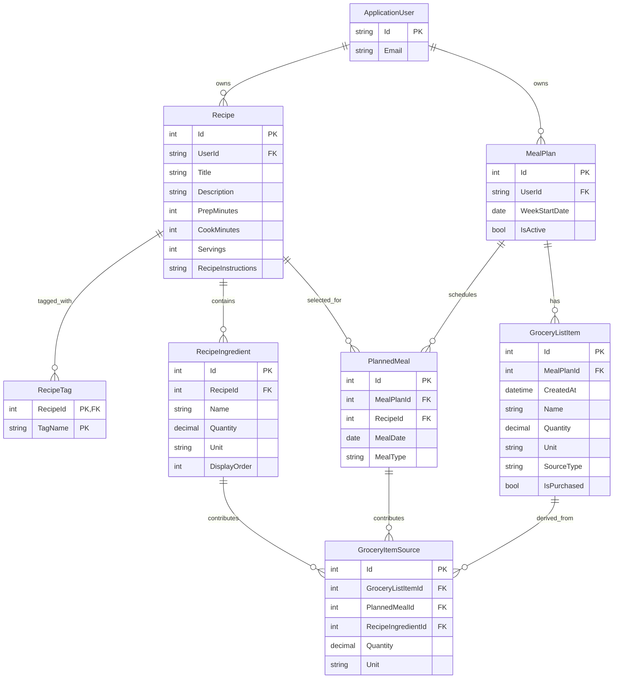

# Meal Planner ERD

```mermaid
erDiagram
    ApplicationUser ||--o{ Recipe : owns
    ApplicationUser ||--o{ MealPlan : owns
    Recipe ||--o{ RecipeTag : tagged_with
    Recipe ||--o{ RecipeIngredient : contains
    Recipe ||--o{ PlannedMeal : selected_for
    MealPlan ||--o{ PlannedMeal : schedules
    MealPlan ||--o{ GroceryListItem : has
    PlannedMeal ||--o{ GroceryItemSource : contributes
    RecipeIngredient ||--o{ GroceryItemSource : contributes
    GroceryListItem ||--o{ GroceryItemSource : derived_from

    ApplicationUser {
        string Id PK
        string Email
    }

    Recipe {
        int Id PK
        string UserId FK
        string Title
        string Description
        int PrepMinutes
        int CookMinutes
        int Servings
        string RecipeInstructions
    }

    RecipeTag {
        int RecipeId PK, FK
        string TagName PK
    }

    RecipeIngredient {
        int Id PK
        int RecipeId FK
        string Name
        decimal Quantity
        string Unit
        int DisplayOrder
    }

    MealPlan {
        int Id PK
        string UserId FK
        date WeekStartDate
        bool IsActive
    }

    PlannedMeal {
        int Id PK
        int MealPlanId FK
        int RecipeId FK
        date MealDate
        string MealType
    }

    GroceryListItem {
        int Id PK
        int MealPlanId FK
        datetime CreatedAt
        string Name
        decimal Quantity
        string Unit
        string SourceType
        bool IsPurchased
    }

    GroceryItemSource {
        int Id PK
        int GroceryListItemId FK
        int PlannedMealId FK
        int RecipeIngredientId FK
        decimal Quantity
        string Unit
    }
```
